# ShapeGrasp: Zero-Shot Object Manipulation with LLMs through Geometric Decomposition

[Project page](https://shapegrasp.github.io/) | [ShapeGrasp arXiv](https://arxiv.org/abs/2403.18062)

## Abstract

Task-oriented grasping of unfamiliar objects is a necessary skill for robots in dynamic in-home environments. Inspired by the human capability to grasp such objects through intuition about their shape and structure, we present a novel zero-shot task-oriented grasping method leveraging a geometric decomposition of the target object into simple, convex shapes that we represent in a graph structure, including geometric attributes and spatial relationships. Our approach employs minimal essential information—the object's name and the intended task—to facilitate zero-shot task-oriented grasping. We utilize the commonsense reasoning capabilities of large language models to dynamically assign semantic meaning to each decomposed part and subsequently reason over the utility of each part for the intended task. Through extensive experiments on a real-world robotics platform, we demonstrate that our grasping approach's decomposition and reasoning pipeline is capable of selecting the correct part in 92% of the cases and successfully grasping the object in 82% of the tasks we evaluate.

---

## Demo — ManiSkill YCB Evaluation

Ran ShapeGrasp on all 49 YCB objects in the ManiSkill `PickSingleYCB-v1` environment using **Qwen2-VL-7B-Instruct** (local, no OpenAI API). Motion-planned grasps were recorded via `PandaArmMotionPlanningSolver`.

**Result: 30/49 objects successfully grasped (61%)**

### Pipeline — Scissors ("cut a piece of paper")

| RGB | Decomposition | Shape Graph | Grasp |
|-----|--------------|-------------|-------|
| 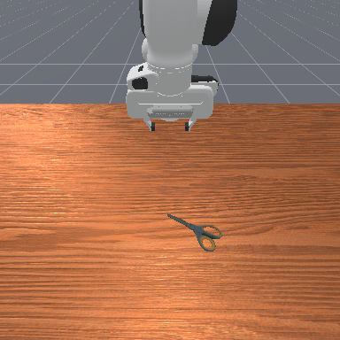 | 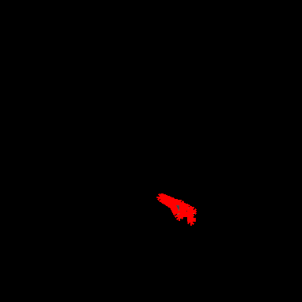 | 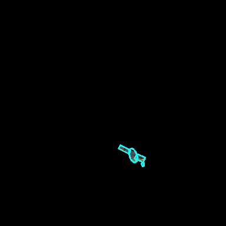 | 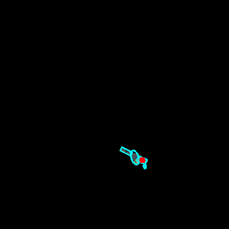 |

Animated pipeline:

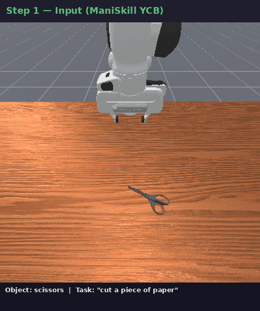

### More Grasp Results

| Object | Task | Grasp | Pipeline |
|--------|------|-------|----------|
| Master Chef Can | pour coffee | 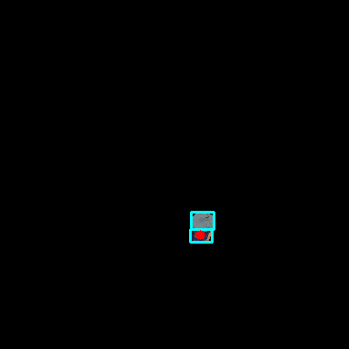 | 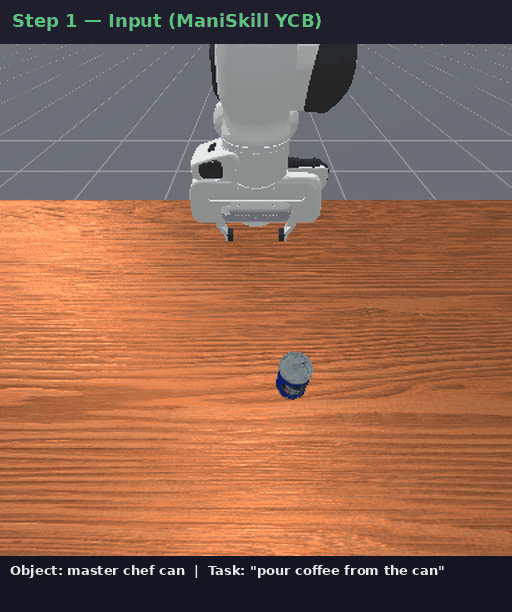 |
| Mustard Bottle | squeeze mustard | 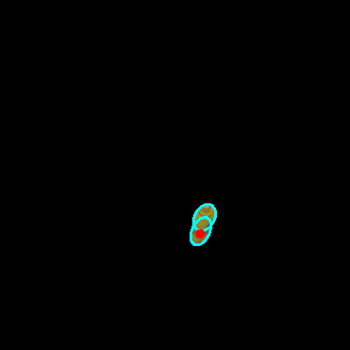 | 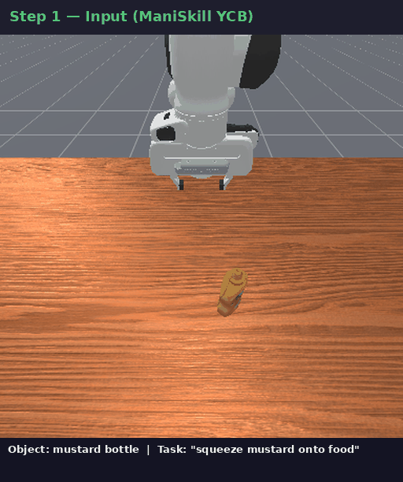 |
| Banana | peel the banana | 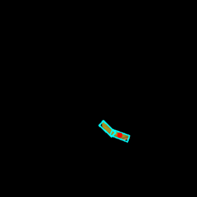 | 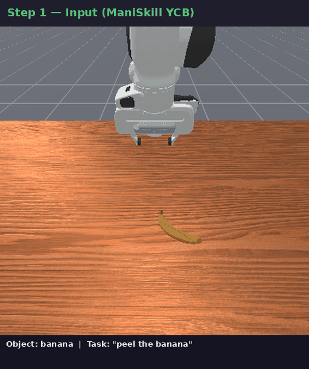 |

### Motion-Planning Videos (ManiSkill)

Full grasping videos rendered with `PandaArmMotionPlanningSolver` → `RecordEpisode`. Click to view (hosted on localhost:4000):

| Object | Task | Video |
|--------|------|-------|
| Scissors | cut a piece of paper | [037_scissors.mp4](http://localhost:4000/assets/maniskill_videos/037_scissors.mp4) |
| Master Chef Can | pour coffee | [002_master_chef_can.mp4](http://localhost:4000/assets/maniskill_videos/002_master_chef_can.mp4) |
| Mustard Bottle | squeeze mustard | [006_mustard_bottle.mp4](http://localhost:4000/assets/maniskill_videos/006_mustard_bottle.mp4) |
| Banana | peel the banana | [011_banana.mp4](http://localhost:4000/assets/maniskill_videos/011_banana.mp4) |
| Spatula | flip a pancake | [033_spatula.mp4](http://localhost:4000/assets/maniskill_videos/033_spatula.mp4) |
| Phillips Screwdriver | tighten a screw | [043_phillips_screwdriver.mp4](http://localhost:4000/assets/maniskill_videos/043_phillips_screwdriver.mp4) |
| Flat Screwdriver | tighten a screw | [044_flat_screwdriver.mp4](http://localhost:4000/assets/maniskill_videos/044_flat_screwdriver.mp4) |
| Apple | take a bite | [013_apple.mp4](http://localhost:4000/assets/maniskill_videos/013_apple.mp4) |
| Mini Soccer Ball | kick the ball | [053_mini_soccer_ball.mp4](http://localhost:4000/assets/maniskill_videos/053_mini_soccer_ball.mp4) |
| Rubik's Cube | solve the puzzle | [077_rubiks_cube.mp4](http://localhost:4000/assets/maniskill_videos/077_rubiks_cube.mp4) |

All 49 videos available at [http://localhost:4000/runs/20260622_211951_shapegrasp_ycb/videos/](http://localhost:4000/runs/20260622_211951_shapegrasp_ycb/videos/)

---

## Demo — Real-World Image (Bottle)

Ran ShapeGrasp on a real lab image using **GroundingDINO + SAM** for auto-segmentation, then **Qwen2-VL-7B** for grasp reasoning. No depth sensor needed (2D mode).

| Detection | Segmentation | Grasp Prediction |
|-----------|-------------|-----------------|
| 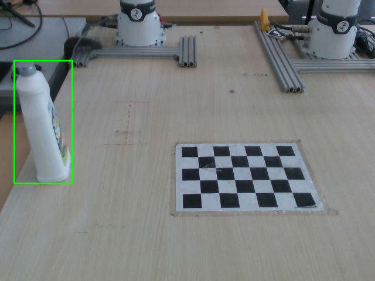 | 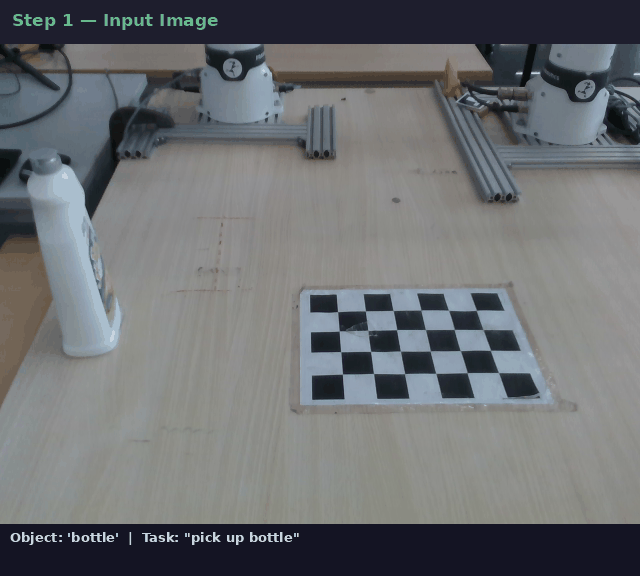 | 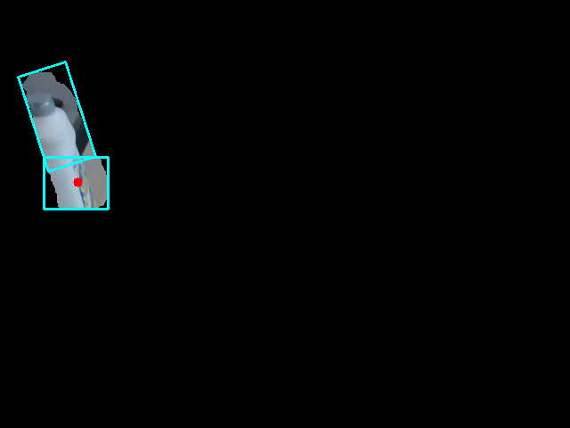 |


### Real-World Demo — Computer Mouse ("pick up mouse")

Shot with a mobile phone in a real robotics lab (Franka arm on table). GroundingDINO detected the mouse at score 0.86.

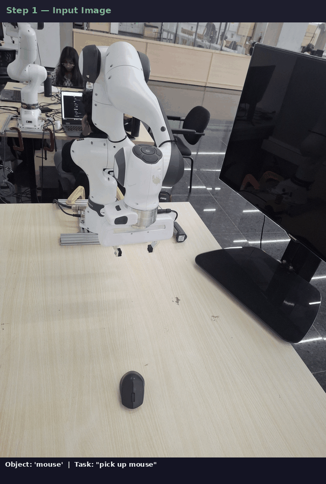

| Detection | Decomposition | Shape Graph | Grasp |
|-----------|--------------|-------------|-------|
|  | 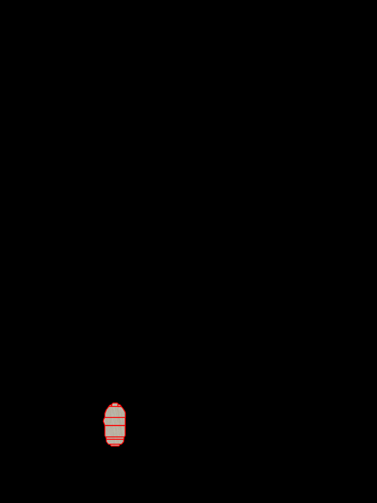 |  |  |

---

## Installation

### With local VLM (Qwen2-VL-7B, no OpenAI API)

```bash
conda activate graspmas   # reuse existing env with ROCm PyTorch
pip install coacd
```

Node.js / TypeScript (for TypeChat schema validation):
```bash
nvm install 20 && npm install -g typescript
```

### With OpenAI API (original)

```bash
conda env create -f environment.yml
pip install coacd openai==1.12.0 httpx==0.26.0
npm install -g typescript
```

---

## Running on a Real Image

Auto-segments the object with GroundingDINO + SAM, then runs ShapeGrasp:

```bash
VLM_DEVICE=cuda:0 conda run -n graspmas python run_real_image.py \
    --image /path/to/photo.jpg \
    --object "bottle" \
    --task "pick up bottle"
```

Options:

| Flag | Default | Description |
|---|---|---|
| `--image` | required | Input photo (.jpg/.png) |
| `--object` | required | Object label for GroundingDINO |
| `--task` | required | Task string for Qwen |
| `--mode` | `2d` | `2d` (RGB only) or `3d` (MiDAS depth) |
| `--device` | `$VLM_DEVICE` | GPU to use |
| `--det_threshold` | `0.30` | Lower if object not detected |

Outputs saved to `real_outputs/<object>_<timestamp>/` — pipeline GIF, segmentation mask, grasp prediction.

---

## Running on YCB Objects (ManiSkill)

```bash
# Run ShapeGrasp on all 49 YCB objects
VLM_DEVICE=cuda:0 conda run -n graspmas python run_ycb_eval.py

# Render motion-planning videos
VLM_DEVICE=cuda:0 conda run -n graspmas python render_ycb_videos.py \
    --run runs/<timestamp>_shapegrasp_ycb
```

---

## Running the Original Demo

```bash
# 2D mode (RGB + mask)
python demo.py --mode 2d --obj knife --data_dir data/ --task "cut bread"

# 3D mode (RGB + mask + depth)
python demo.py --mode 3d --obj knife --data_dir data/ --task "cut bread"
```

Place input files in `data_dir`:
- `{obj}_rgb.png` — RGB image
- `{obj}_mask.png` — binary mask (0/255)
- `{obj}_depth.npy` — depth map (3D mode only)

---

## Getting Started

The pipeline depends on a single-view RGB image and binary mask, and a depth image for 3D mode, to decompose and select a task-oriented grasping part. These files should be named as follows and placed in your specified `data_dir`:

- `{obj}_depth.png` (not needed in 2D mode) — npy or png file, 1 or 3 channels
- `{obj}_mask.npy` — npy or png file, 1 or 3 channels, binary or 0-255
- `{obj}_rgb.png` — npy or png file

---

## Citation

```bibtex
@article{Li2024ShapeGraspZT,
  title={ShapeGrasp: Zero-Shot Task-Oriented Grasping with Large Language Models through Geometric Decomposition},
  author={Samuel Li and Sarthak Bhagat and Joseph Campbell and Yaqi Xie and Woojun Kim and Katia P. Sycara and Simon Stepputtis},
  journal={2024 IEEE/RSJ International Conference on Intelligent Robots and Systems (IROS)},
  year={2024},
  pages={10527-10534},
}
```

## License

This project is licensed under the terms of the [MIT License](LICENSE).
